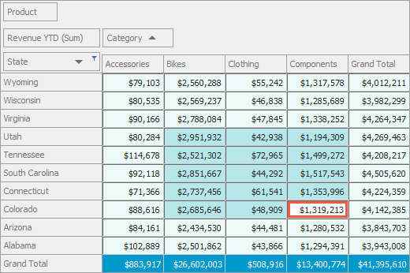

<!-- default badges list -->

<!-- default badges end -->
# Pivot Grid for WinForms - Customize Cells 

The following example shows how to handle the [PivotGridControl.CustomDrawCell](https://docs.devexpress.com/WindowsForms/DevExpress.XtraPivotGrid.PivotGridControl.CustomDrawCell) event to paint Pivot Grid cells according to the cell's state (selected or unselected) and the cell's type (data cells or grand total cells).

The following image illustrates the resulting UI:  

## Files to Look At

[Form1.cs](CS/PivotCustomDraw/Form1.cs) / [Form1.vb](VB/PivotCustomDraw/Form1.vb)

## Documentation

[Custom Draw](https://docs.devexpress.com/WindowsForms/1817/controls-and-libraries/pivot-grid/appearance/custom-draw)

## More Examples

- [Pivot Grid for WinForms - Change the Field Value Header Background with the CustomDrawFieldValue Event](https://github.com/DevExpress-Examples/how-to-change-the-field-value-header-appearance-backcolor-or-draw-it-manually-e2809)
- [Pivot Grid for WinForms - Draw a Custom Element when a User Hovering Over Field Value with a Mouse](https://github.com/DevExpress-Examples/how-to-draw-a-custom-element-when-a-user-hovering-over-field-value-with-a-mouse-e2228)
